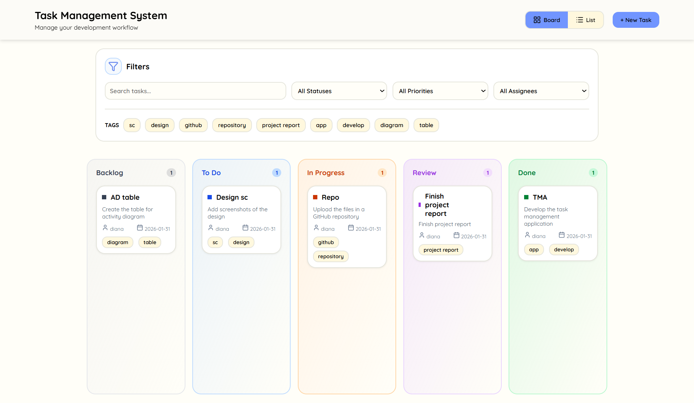

# Task Management system for Software Developers
This project is a simple task management system designed for software developers. It provides and intuitive environment for organizing, tracking, and visualizing development tasks through flexible workflow management and visual modes.

### Features
The application provides the following core functionality:
- creation, editing, and deletion of tasks.
- flexible task lifecycle with multiple workflow states.
- board view with drag-and-drop task transitions.
- list view with structured tabular representation.
- dynamic filtering and search functionality.
- persistent local storage of tasks across sessions.

### Technology stack
The prototype is implemented using modern web technologies:
1. React.js - component-based UI framework.
2. JavaScript - application logic.
3. HTML5 & CSS3 - structure & styling.

## Installation guide
Before starting, make sure you have `node.js` installed in your computer. If not, you can download it here: https://nodejs.org/en/download 
1. Run `npm install -g create-react-app` to install React.
2. Run `npx create-react-app my-app`.
3. Navigate into the `my-app` folder by running: `cd my-app`.
4. In the `src` folder that was created, create a folder named `components` and inside create these files: `Navbar.js`, `Navbar.css`, `FilterBar.js`, `FilterBar.css`, `BoardView.js`, `BoardView.css`, `ListView.js`, `ListView.css`, `AddTaskForm.js`, and `AddTaskForm.css`.
5. Copy and paste the contents of each file of this repository into the corresponding file you created.
6. Copy and paste the contents of `App.js` and `App.css` in this repository into the corresponding files into your application.
7. Install lucide-react for icons using: `npm install lucide-react`
7. Run `npm start`. The application will run automatically in your browser, otherwise click on the link `http://localhost:3000`.

## User Interface

